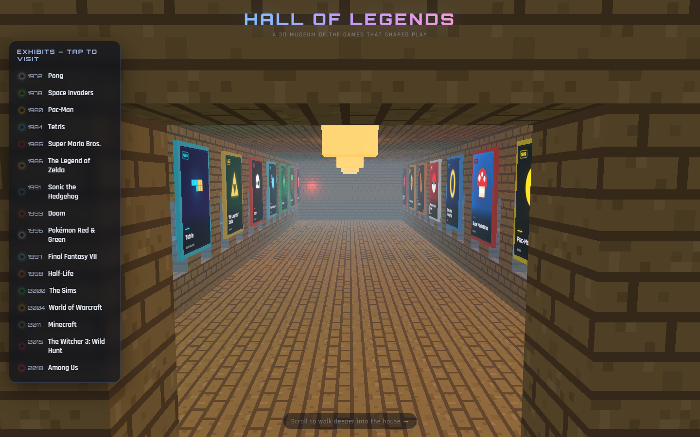
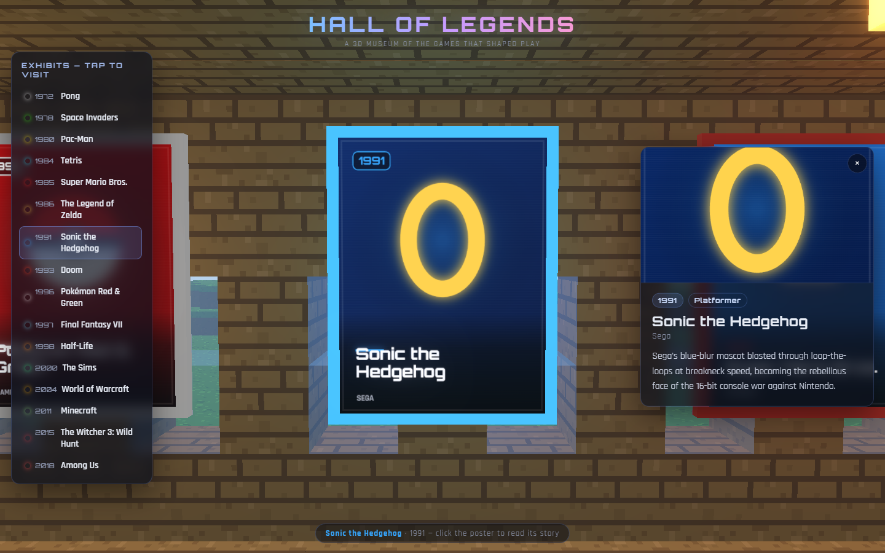
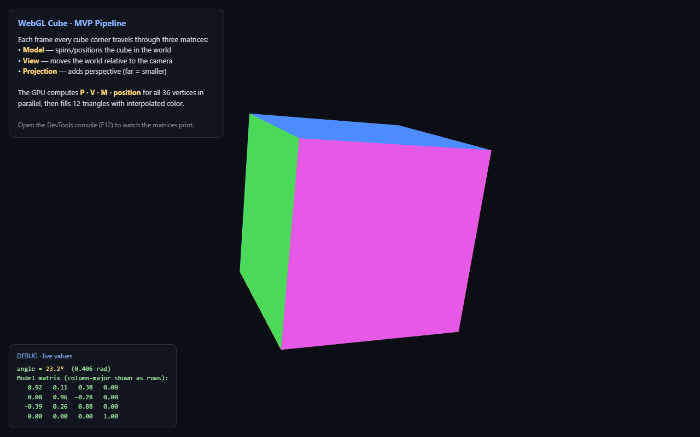
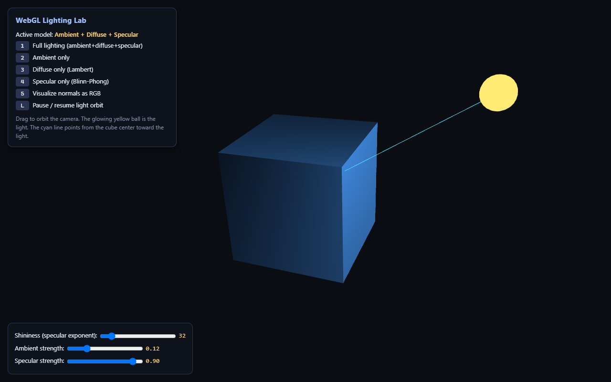

# WebGL & 3D Graphics Learning

A hands-on journey through real-time 3D on the web — starting from **raw WebGL**
(every matrix and shader written by hand) and building up to a polished,
interactive **Three.js** experience. No frameworks, no build step; every file is
self-contained and runs in a browser.

---

## ⭐ Featured: Hall of Legends

[**`hall-of-legends.html`**](hall-of-legends.html) — a **3D Minecraft house you
scroll through**, built with Three.js and set on a floating voxel island
(inspired by the Minecraft-folio style of Andrew Woan / JReyes). **Scroll** to
walk through the front door and glide deeper down the hallway — a new game poster
greets you at every step, telling you what the game is, who made it, and the year
it arrived. 16 legends span five decades — from *Pong* (1972) to *Among Us* (2018).

<table>
  <tr>
    <td width="58%"></td>
    <td width="42%"></td>
  </tr>
  <tr>
    <td align="center">Scroll deeper down the hall…</td>
    <td align="center">…and click a poster for its story</td>
  </tr>
</table>

**Highlights**

- Pure Three.js loaded via an importmap from a CDN — no `npm install`, no bundler
- A **fully procedural Minecraft world**: a floating island of `InstancedMesh` voxels (grass / dirt / stone with a rounded underside), a few oak trees, drifting blocky clouds and a gradient sky — all built from cubes
- A **house made from the same blocks**: stone foundation, plank walls, log corners, glass windows, a flat roof, a front doorway, and warm glowstone lanterns inside
- **Scroll-to-explore navigation** — the camera follows a path of "stations" from outside the door down the hall, turning to face each poster in turn (also works with arrow keys, touch-drag, or the sidebar)
- 16 wall-mounted posters with **procedural cover art** drawn on a `<canvas>` — hand-coded iconic symbols (Pac-Man, the Space Invaders alien, a Tetris stack, a Pokéball, an Among Us crewmate…)
- Pixel-art, nearest-filtered block textures with per-face Minecraft-style lighting
- Click a poster (or a sidebar entry) for an HTML detail card; gentle mouse-move parallax; `Esc` to close

> ⚠️ Because it imports Three.js as ES modules from a CDN, open it via a local
> server (e.g. `python -m http.server` then visit
> `http://localhost:8000/hall-of-legends.html`) rather than double-clicking the file.

---

## The raw-WebGL foundations

Before the Three.js layer, these files build the same ideas **from scratch** —
no helper libraries — so the whole graphics pipeline is visible and hackable.
Each one doubles as a tutorial you can read top-to-bottom.

> Plain WebGL 1 + GLSL. Just open the HTML files in a browser.

<table>
  <tr>
    <td width="50%"></td>
    <td width="50%"></td>
  </tr>
  <tr>
    <td align="center"><code>webgl-cube-mvp.html</code> — the MVP matrix pipeline</td>
    <td align="center"><code>cube_lighting.html</code> — the lighting model</td>
  </tr>
</table>

## What's inside

| File | What it demonstrates |
|------|----------------------|
| [`webgl-cube-mvp.html`](webgl-cube-mvp.html) | A rotating, vertex-colored cube built around the **Model · View · Projection** matrix pipeline. Matrix math (identity, translate, rotate, perspective, multiply) is implemented from scratch, with a live debug panel printing the matrices as they update. |
| [`cube_lighting.html`](cube_lighting.html) | A lit cube using surface normals, the normal matrix, and the **Ambient + Lambert diffuse + Blinn-Phong specular** lighting model. Includes an orbiting light, mouse-drag camera, and toggles to isolate each lighting term. |
| [`GRAPHICS_MATH.md`](GRAPHICS_MATH.md) | A computational reference for *all* the math used above — vectors, dot/cross products, homogeneous coordinates, the view & perspective matrices, the perspective divide, normals, and the lighting equations. Each topic gives the idea, the formula, and a fully worked numeric example you can verify by hand. |

## Topics covered

- Compiling and linking GLSL vertex/fragment shaders
- Building 4×4 transform matrices from scratch (translation, rotation, perspective)
- Column-vector / column-major conventions and why they matter to WebGL
- Interleaved vertex buffers (`[x, y, z, r, g, b]`) and attribute pointers
- Passing uniforms (matrices, light parameters) to the GPU
- The `requestAnimationFrame` render loop and depth testing
- Surface normals and the inverse-transpose normal matrix
- The ambient + diffuse + specular lighting model, term by term

## Running it

No server, no dependencies, no install. Just open a file in any modern browser:

- Double-click `webgl-cube-mvp.html` or `cube_lighting.html`, **or**
- Serve the folder locally if you prefer:

  ```bash
  python -m http.server 8000
  # then visit http://localhost:8000/cube_lighting.html
  ```

### Controls (`cube_lighting.html`)

| Input | Action |
|-------|--------|
| `1` | Full lighting (ambient + diffuse + specular) |
| `2` | Ambient only |
| `3` | Diffuse only (Lambert) |
| `4` | Specular only (Blinn-Phong) |
| `5` | Visualize normals as RGB |
| `L` | Pause / resume the orbiting light |
| Mouse drag | Orbit the camera |
| Scroll wheel | Zoom |
| Sliders | Adjust ambient & specular strength |

## Why raw WebGL?

Libraries like Three.js hide the interesting parts. The goal here is to
understand *exactly* what happens between a list of vertices and a lit pixel on
screen — so everything is built up by hand and explained inline.
